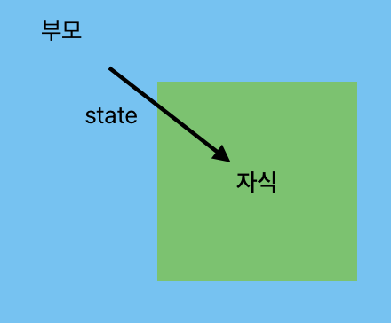

# Props

자식이 부모의 state 를 가져다가 쓰고 싶을 때 사용하는 것.

## 사용방법



1. 부모에서 <자식컴포넌트 작명={state이름} />
2. 자식에서 function 에 props라는 파라미터 등록 후 props.작명 사용

### 예제

```js
const Modal = (props) => {
  return (
    <>
      {props.open && (
        <div className="modal">
          <h4>{modalTitle}</h4>
          <p>{modalDate}</p>
          <p>{modalContent}</p>
        </div>
      )}
    </>
  );
};
```
